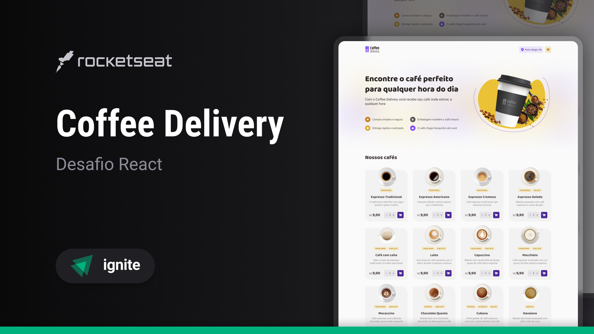

<div align="center">
  <h1>Coffee Delivery</h1>
  <p>Esse projeto foi desenvolvido como parte da minha aprendizagem em React. O Coffee Delivery é um site para compra de cafés, permitindo ao usuário selecionar seus cafés favoritos, adicionar ao carrinho e preencher um formulário para a entrega. O projeto utiliza as tecnologias React, TypeScript, CSS e HTML.</p>

  <p>
    
  </p>

  
</div>

---

## ☕ Funcionalidades

- Armazenamento de informações no **Local Storage** para persistência de dados.
- **Design responsivo**, garantindo uma boa experiência em diferentes dispositivos.
- Função de **adicionar e remover cafés** do carrinho.
- **Validação de formulário** para garantir o correto preenchimento dos dados de entrega.

## 🌐 Acesse o projeto online

Você pode visualizar e testar o projeto através do link abaixo:

🔗 [Coffee Delivery Online](https://coffee-delivery-rodrigolevinos-projects.vercel.app/)

## 🚀 Tecnologias

As principais tecnologias e ferramentas utilizadas no projeto incluem:

- **[React](https://reactjs.org/)** para dividir o projeto em partes, com componentes.
- **[TypeScript](https://www.typescriptlang.org/)** para adicionar tipagem estática ao JavaScript.
- **CSS** para estilização personalizada.
- **HTML** para a estrutura base.

## 📦 Instalação e execução

Siga os passos abaixo para instalar e executar o projeto em sua máquina local:

1. Clone o repositório:

   ```bash
   git clone https://github.com/rodrigolevino/CoffeeDelivery.git
   cd CoffeeDelivery
   ```

2. Instale as dependências do projeto:
   ```bash
   npm install
   ```

3. Inicie o servidor de desenvolvimento:
   ```bash
   npm run dev
   ```

4. Acesse o projeto em seu navegador no endereço:
   ```bash
   http://localhost:5173
   ```

> **Nota:** Certifique-se de ter o **Node.js** instalado em sua máquina, pois o npm é fornecido junto com ele.

## 📝 Licença

Este projeto está sob a licença MIT. Consulte o arquivo [LICENSE](./LICENSE) para mais informações.

